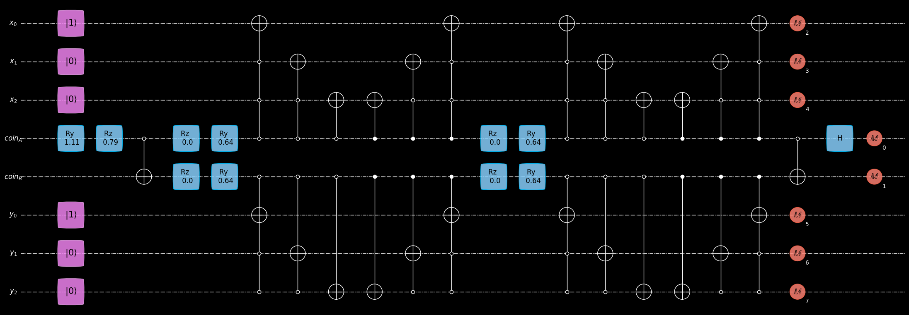

# Entangled-Walkers-QKD
Simulation of a quantum key distribution (QKD) protocol based on entangled quantum walkers. This project uses the quantum SDK `geqo` to simulate quantum circuits for the protocol. 

For more information on `geqo`, see:

Github: https://github.com/JoSQUANTUM/geqo/
Documentation: https://geqo.jos-quantum.de/intro.html

## Installation

Clone the repository and install locally:

```bash
git clone https://github.com/jordan0809/Entangled-Walkers-QKD.git
cd Entangled-Walkers-QKD
pip install .
```

## Example Usage

See the notebook `notebooks/entangled_quantum_walkers_qkd.ipynb`.

## Gallery

